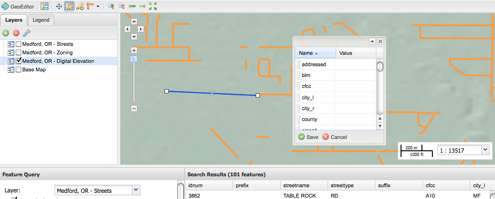
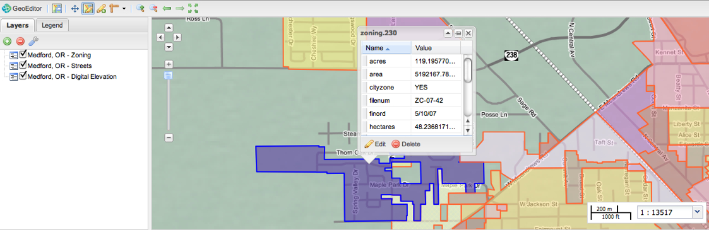
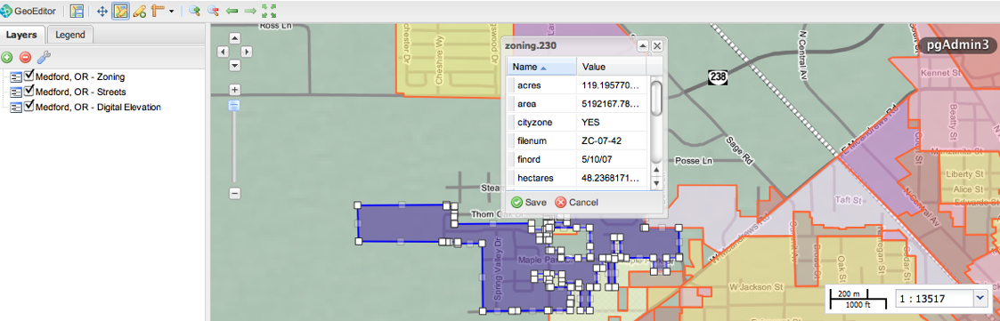
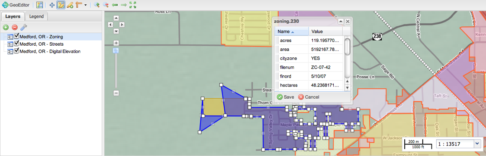
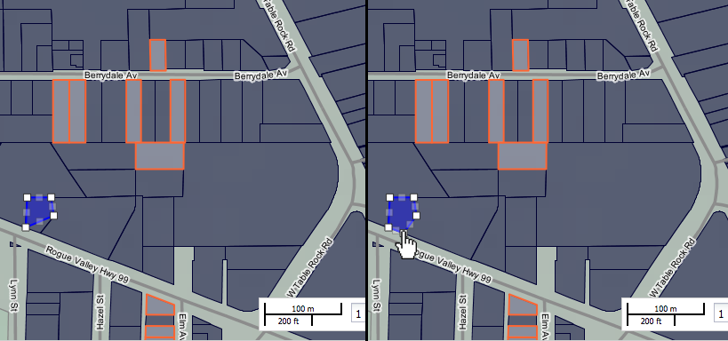
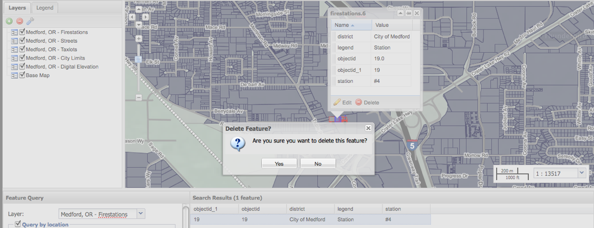

.. _geoeditor.modifying:

Modifying Data
==============

With your dataset prepared, you are now ready to modify vector features and/or attribute information. The basic workflow for editing data includes:

Choose whether you want to create new features or modify an existing one.
Add or edit attributes of the feature.
Save edits and stop editing.

Creating a New Feature
----------------------

One of the most common editing tasks is to create new features. 

To start, select the :guilabel:`Create a new feature` tool from the Tools panel.  With this tool you can draw a *draft* geometry of line, point, polygon as well a vertices at intersections or midpoint.  A draft is composed of all the vertices or anchor points of a feature.   

To add vertices, position your pointer within the Map window and click. For point geometries, a single click will create a point feature.  

For lines and polygon geometries, continue positioning vertices with a single click.  To complete a feature draft double click your mouse.  The positioned vertices will create a feature of the same geometry type.  

   *A line draft for Medford streets*

.. note:: You can delete vertices by positioning your pointer over a vertex and hitting the ``d`` key.

By default, the :guilabel:`Create a new feature` changes to the :guilabel:`Edit existing feature` tool. Here you can edit new attribute` values. Attributes are descriptions of a geographic feature stored as a row in a table.

Modifying Existing Features
---------------------------

To start modifying existing features, use the :guilabel:`Edit existing feature` tool and click anywhere within the feature component.  

   *Medford zone 230 selected for editing*

A feature will now selected in *draft* mode for editing. Activate your editing session by clicking the :guilabel:`Edit` button.  

   *Medford zone 230 ready for editing*

Reshaping
~~~~~~~~~
To reshape a feature, you can select a vertex and drag it to a new location.  You can also specify a new vertex by clicking and dragging a *phantom* vertex.   For instance, you can drag a vertex to restructure the boundaries of a zone with a fish tail.

   *Modified zone 230*

Deleting Vertices
~~~~~~~~~~~~~~~~~
Position the your pointer over a vertex and press :guilabel:`Shift-D` to delete.  GeoEditor immediately previews the modified feature.  
 

   *Deleting a taxlot corner*

Deleting Features
~~~~~~~~~~~~~~~~~

In order to delete a feature from the map and the datastore, select the :guilabel:`Edit existing feature` tool. Click within the feature you want to delete and select the :guilabel:`Delete` button in the resulting dialog. You will be prompted to confirm the feature deletion. 

   *Selecting a firestation to delete*
   
Inputting attributes 
--------------------

You can add or edit attributes by selecting the text field. Select :guilabel:`Save` to apply them to your data source. 

   .. figure:: images/modify7.png
      :align: center
      :width: 600px

      *Attribute table for a new feature*

Saving 
------

Any GeoEditor modifications are temporary until you choose to :guilabel:`Save` them.  Canceling or quitting will not save your changes, nor will bookmarking a map document.  To write edits to a data source, you need to specifically save the edits.

