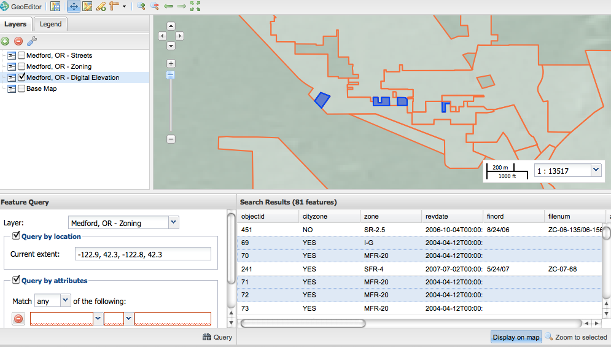

.. _geoeditor.preparing:

Preparing Data
==============

Before modifying features with GeoEditor, you need to prepare an existing feature to edit.  Using the the :guilabel:`Layers panel`, add any layers for viewing.  This should include the layer to be edited, but can also include other layers for context.  Once you have added the layers, you can follow a basic workflow.

#. Select into an area you would like to edit. 
#. Start an edit session by executing a feature query.

Area Selection
--------------

To select an area for editing, you first need to frame the data in an appropriate view.  Although you can edit data in any view, it is generally best to select a frame with the most detail. 

There are several options for selecting your data frame.  Use can use the pan and zoom tools available in the :guilabel:`Tools panel` along with the control options in the :guilabel:`Map window` to position and scale an image.  When you use these Zoom tools, each click or scale selection magnifies or reduces the image to the next preset around the current center point.  Double-clicking a point, allows you specify the center of an area you want to magnify.  

For a smooth zoom, you can also hold down Shift and drag a red rectangle around the area you want to magnify. For a smooth pan, you can use the :guilabel:`Pan Map` tool to nudge the map in the direction you want to view. 

   *Selecting an area for editing* 

Feature Query
-------------

Once your data frame is set, specify the layer for modification with the :guilabel:`Feature Query` drop down (or up) menu.  Highlighting a layer in the Layers panel will not set this target layer.

   *Selecting the Zoning layer for editing*

With the editing layer specified, you now need to define a set of features for editing.  The query by :guilabel:`location` condition allows you to select the first 100 features within the current frame bounds.  The query by :guilabel:`attribute` condition(s) allows you to define a data set based on any attributes within the feature. These two query categories can be used separately or in tandem.

A query will return table results as well as a map display (in orange) with up to the first 100 features for which the associated query applies.  

   *Search results for a location query. Notice the orange outlines of the Zoning feature set*

With the :guilabel:`Display on map` you can toggle visibility of the entire search results, or select specific results in for display (in blue).  You can display a specific result subset with the :guilabel:`Zoom to selected` button. 

   *Display of selected Zones* 

 