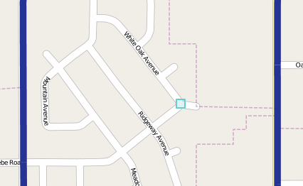

.. _geoexplorer.using.createfeature:

Create a New Feature
====================

GeoExplorer includes the ability to create new features in layers served through a local instance of GeoServer.  You can draw the location of the feature, as well as edit the attribute data for that feature.

.. note:: Authentication is required to create features through GeoExplorer.  For more information, please see the :ref:`geoexplorer.using.login` section.

.. warning:: Creation of features happens directly on the data source served in GeoServer (via :term:`WFS-T`), so the changes that are made go live immediately once the :guilabel:`Save` button is clicked.

To create a new feature, select the layer you wish to add features to, and then click the :guilabel:`Create a new feature` button.

   *Create a New Feature button*

Click on an area of the Map Window where a feature should be placed.

   *Initial point for new feature*

If operating on a point layer, the creation will cease after the first click.  If operating on a line or polygon layer, you can click on the Map Window to add additional vertices to the feature.  You can also hold down the Shift key and the mouse button while dragging in order to create (approximations of) curved lines.  When finished, double-click at the final point.

   *Completely drawn new feature*

To delete the newly-created feature and start over, double-click to finish feature creation, and then click :guilabel:`Cancel` at the following dialog.

Editing a newly created feature
-------------------------------

Once a feature has been created, a dialog will pop up with a listing of the layer's attributes.  Enter in the values of the attributes for the new feature and then click :guilabel:`Save`.  To delete the newly-created feature and start over, click :guilabel:`Cancel` and the feature will be removed from the map.  

.. note:: Until the :guilabel:`Save` button is clicked, no information will be passed to GeoServer.

   *Editing attributes for new feature*

   *Attributes populated for new feature*

   *New feature successfully created*

From this point on, the feature has become part of the active layer, and will be displayed given the layer's current styling.  To create more features, click the :guilabel:`Create a new feature` button to begin again.