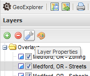

.. _geoexplorer.using.layerproperties:

Layer Properties
================

You can view and edit the properties for a given layer that is loaded in GeoExplorer.

.. note:: Special base layers such as those from Google do not have the option of viewing layer properties.

To access the Layer Properties dialog, select a layer by clicking on it in the :ref:`geoexplorer.workspace.layerspanel`, then click the :guilabel:`Layer Properties` button in the Layer Panel toolbar, or right-click and select :guilabel:`Layer Properties` in the context menu.

There are four tabs in the Layer Properties window:

    .. list-table::
       :header-rows: 1
       :widths: 30 70

       * - Name
         - Description
       * - :guilabel:`About`
         - Displays metadata about the layer.
       * - :guilabel:`Display`
         - Displays options related to the rendering of the layer by GeoExplorer
       * - :guilabel:`Cache`
         - Shows if the layer is using cached version
       * - :guilabel:`Styles`
         - Allows for editing the styles and style rules for a the layer

   *Layer Properties button in the Layers Panel toolbar*

.. _geoexplorer.using.layerproperties.about:

About tab
---------

The About tab displays layer metadata.  This information comes directly from the server.  The fields displayed are:

.. list-table::
   :header-rows: 1
   :widths: 20 60 20

   * - Field
     - Description
     - Editable?
   * - **Title**
     - This is the human-readable title associated with the layer.
     - Yes
   * - **Name**
     - Internal server name for the layer.
     - No
   * - **Description**
     - Also known as Abstract, this field displays a description of the layer.
     - Yes

   *About tab in the Layer Properties dialog*

.. _geoexplorer.using.layerproperties.display:

Display tab
-----------

The Display tab displays options related to the rendering of the layer by GeoExplorer.  The fields displayed are:

.. list-table::
   :header-rows: 1
   :widths: 30 70

   * - Field
     - Description
   * - **Opacity**
     - Determines the level of transparency in the layer.  Default is 100% opaque.  You can adjust opacity by dragging the slider bar.
   * - **Format**
     - Determines the format of the displayed images.  Can be one of:
         * :guilabel:`image/png` (24-bit PNG) (*Default*)
         * :guilabel:`image/gif` (GIF)
         * :guilabel:`image/jpeg` (JPEG)
         * :guilabel:`image/png8` (8-bit PNG)
   * - **Transparent**
     - Sets transparency for a given layer.  Default is checked.  If this box is unchecked, the layer displays just like a Base Layer, hiding any existing layers drawn beneath it.  See the :ref:`geoexplorer.workspace.layerspanel.layerorder` section for more information on how layers are drawn.

.. figure:: images/properties_display.png
   :align: center

   *Display tab in the Layer Properties dialog*

.. _geoexplorer.using.layerproperties.cache:

Cache tab
---------

GeoExplorer recognizes :term:`WMS-C` layers, and therefore has the option to allow for built-in caching support if it exists on the server.  In the case of layers served through GeoServer, the integrated GeoWebCache module allows for automatic caching of tiles served through the GeoServer WMS.  This means that as images are loaded in GeoExplorer (through standard zooming and panning), the underlying tiles are stored on the server, accelerating subsequent layer viewing and improving map performance.

The Cache tab displays whether the layer should respect the cached version, utilizing any saved tiles and generating more, or if it should use bypass the cache entirely.

There is one option:  :guilabel:`Use cached version`.  Default for all layers is checked, if applicable.

   *Cache tab in the Layer Properties dialog*

.. _geoexplorer.using.layerproperties.styles:

Styles tab
----------

GeoExplorer now has an integrated style editor for layers served through a :term:`WMS` server utilizing the :term:`SLD` standard.  The Styles tab allows you to view, add, edit, and delete styles and individual style rules.

   *Styles tab in the Layer Properties dialog*

.. note:: Editing styles is discussed in the :ref:`geoexplorer.using.style` section.

