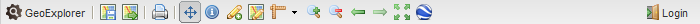
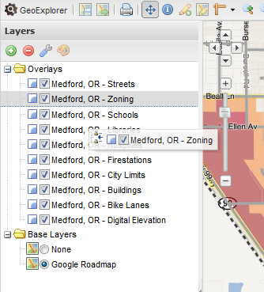

.. _geoexplorer.workspace:

GeoExplorer Workspace
=====================

The GeoExplorer workspace is divided into four areas

#. :ref:`geoexplorer.workspace.mapwindow`, where the map is displayed
#. :ref:`geoexplorer.workspace.toolbar`, the bar at the top where zoom, pan, and export tools are accessed
#. :ref:`geoexplorer.workspace.layerspanel`, where a list of map layers is displayed
#. :ref:`geoexplorer.workspace.legendpanel`, where the styles of the displayed layers are listed.

   *GeoExplorer Workspace*

.. _geoexplorer.workspace.mapwindow:

Map Window
----------

The primary component of the GeoExplorer workspace is the Map Window.  This displays the map as currently composed, along with controls for zoom, pan, and scale.  The contents of the Map Window are configured via the :ref:`geoexplorer.workspace.layerspanel`.

.. _geoexplorer.workspace.toolbar:

Toolbar
-------

   *Toolbar*

The Toolbar contains buttons that accomplish certain tasks:

  .. list-table::
     :header-rows: 1
     :widths: 15 30 85 

     * - Button
       - Name
       - Description
     * - .. image:: images/button_geoexplorer.png
       - GeoExplorer
       - Shows information about the GeoExplorer application.
     * - .. image:: images/button_savemap.png
       - :ref:`geoexplorer.using.save`
       - Saves the current state of the Map Window and generates a URL to use in order to revisit the current configuration.
     * - .. image:: images/button_publishmap.png
       - :ref:`geoexplorer.using.export`
       - Composes a map application based on the current Map Window and generates HTML code to embed the application into a web page.
     * - .. image:: images/button_print.png
       - :ref:`geoexplorer.using.print`
       - Opens a dialog for creating PDFs of the current map view.
     * - .. image:: images/button_panmap.png
       - Pan Map
       - Sets the mouse action to dragging the map when dragging the Map Window and zooming via an extent rectangle when shift-click-dragging.  Enabled by default.
     * - .. image:: images/button_getfeatureinfo.png
       - :ref:`geoexplorer.using.getfeatureinfo`
       - Sets the mouse action to display feature info (attributes) for the features when located at a given point when clicked.  Dragging has no effect when this tool is activated.
     * - .. image:: images/button_createfeature.png
       - :ref:`geoexplorer.using.createfeature`
       - Creates a new feature on the selected layer which can then be edited.  Works with overlays only.  Requires :ref:`geoexplorer.using.login` to local GeoServer.
     * - .. image:: images/button_editfeature.png
       - :ref:`geoexplorer.using.editfeature`
       - Edits an existing feature on the selected layer.  Works with overlays only and requires authentication to the server.  Requires :ref:`geoexplorer.using.login` to local GeoServer.
     * - .. image:: images/button_measure.png
       - :ref:`geoexplorer.using.measure`
       - Sets the mouse action to measure distance or area on the map.
     * - .. image:: images/button_zoomin.png
       - Zoom In
       - Increases the zoom level by one.
     * - .. image:: images/button_zoomout.png
       - Zoom Out
       - Decreases the zoom level by one.   
     * - .. image:: images/button_zoomprevious.png
       - Zoom to previous extent
       - Returns to the previous map extent.
     * - .. image:: images/button_zoomnext.png
       - Zoom to next extent
       - Returns to the next map extent.  Activated only after using :guilabel:`Zoom to previous extent`.
     * - .. image:: images/button_zoomvisible.png
       - Zoom to visible extent
       - Zooms to the smallest extent that contains the full extents of all active layers.
     * - .. image:: images/button_3dviewer.png
       - Switch to 3D Viewer
       - Changes map view to 3D.  Requires the `Google Earth browser plugin <http://earth.google.com/plugin/>`_.
     * - .. image:: images/button_login.png
       -  :ref:`geoexplorer.using.login`
       - Sets authentication to local GeoServer (when present) to allow for edits to underlying map features and styling information.

.. _geoexplorer.workspace.layerspanel:

Layers Panel
------------

   *Layers Panel*

The Layers Panel displays a list of all layers active in GeoExplorer.  Each layer's visibility in the Map Window is toggled by the check box next to each entry in the list.  Layer order can be set by clicking and dragging the entries in the list with the mouse.

There are two folders in the Layers Panel, :guilabel:`Overlays` and :guilabel:`Base Layers`, plus a toolbar.

.. _geoexplorer.workspace.layerstoolbar:

Layers toolbar
~~~~~~~~~~~~~~

The Layers Panel contains a toolbar with the following buttons:

  .. list-table::
     :header-rows: 1
     :widths: 15 30 85 

     * - Button
       - Name
       - Description
     * - .. image:: /images/button_addlayers.png
       - :ref:`geoexplorer.using.add`
       - Displays a dialog for adding new layers to GeoExplorer.
     * - .. image:: /images/button_removelayer.png
       - :ref:`geoexplorer.using.remove`
       - Removes the currently selected layer from the list.
     * - .. image:: /images/button_layerproperties.png
       - :ref:`geoexplorer.using.layerproperties`
       - For a selected layer, displays a dialog for viewing and editing metadata, display characteristics, caching settings, and layer styles.  (For attribute information, use the :ref:`geoexplorer.using.getfeatureinfo` Tool.)
     * - .. image:: /images/button_style.png
       - :ref:`geoexplorer.using.style`
       - Displays a dialog for editing map styling rules. Requires :ref:`geoexplorer.using.login` to local GeoServer.

Layer context menu
~~~~~~~~~~~~~~~~~~

You can also right-click on an entry in the list to display a context menu.  This menu contains three options:

  .. list-table::
     :header-rows: 1
     :widths: 15 30 85 

     * - Icon
       - Name
       - Description
     * - .. image:: /images/button_zoomlayer.png
       - Zoom to Layer Extent
       - Zooms to the smallest extent that contains the full extent of the selected layer.
     * - .. image:: /images/button_removelayer.png
       - :ref:`geoexplorer.using.remove`
       - Removes the currently selected layer from the list.
     * - .. image:: /images/button_layerproperties.png
       - :ref:`geoexplorer.using.layerproperties`
       - For a selected layer, displays a dialog for viewing and editing metadata, display characteristics, caching settings, and layer styles.  (For attribute information, use the :ref:`geoexplorer.using.getfeatureinfo` Tool.)
     * - .. image:: /images/button_style.png
       - :ref:`geoexplorer.using.style`
       - Displays a dialog for editing map styling rules. Requires :ref:`geoexplorer.using.login` to local GeoServer.

   *Layer context menu*

Overlays
~~~~~~~~

The Overlays folder shows a list of layers that are known to GeoExplorer.  These layers are set to be transparent, so that multiple layers can be visible at one time.  When starting GeoExplorer, this list is empty; you can :ref:`geoexplorer.using.add` to the list by clicking the :guilabel:`Add New Layers` button.

Base Layers
~~~~~~~~~~~

The Base Layers folder contains a list of layers that can be used as a base layer.  A base layer will always be drawn beneath all other active layers.  Only one layer in this list can be active at any time, but it is possible to have multiple base layers contained in a map. It is also possible to drag layers between the Base Layers folder and Overlays folder.

The default base layer is Google Roadmap.  No base layer ("None") is also an option.  You can :ref:`geoexplorer.using.add` to the list by clicking the :guilabel:`Add New Layers` button.

.. _geoexplorer.workspace.layerspanel.layerorder:

Layer order
~~~~~~~~~~~

Layers that are displayed in this panel can be reordered to affect the rendering order.  To change the order of layers, click and drag the layers in the Overlays list in the :ref:`geoexplorer.workspace.layerspanel`.  The layers will be rendered in the order in which they are listed, meaning that the layer at the top of the list will display on the top of all of the other layers, the next layer will be drawn below that, etc.  The selected base layer will always be drawn beneath all other layers (i.e. first).

   *Reordering Layers*

.. _geoexplorer.workspace.legendpanel:

Legend Panel
------------

   *Legend Panel*

The Legend Panel displays style information for every visible layer.  This list of styles is generated directly from the WMS :term:`GetLegendGraphic` request.  The names of the entries in the styles are taken directly from the SLD from which the layers are styled.  It is possible to edit styles for WMS layers with the :ref:`geoexplorer.using.layerproperties` dialog.