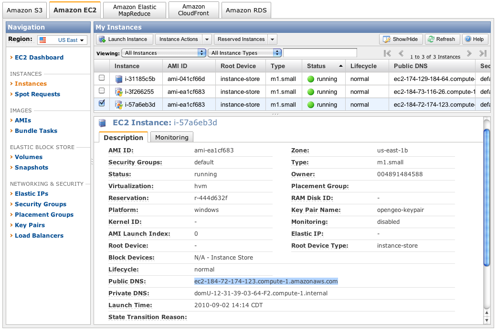

.. _aws.login:

Logging into the OpenGeo Suite Instance
=======================================

This section describes how to log into the OpenGeo Suite instance from either the command line or through a Windows RDP client. 

Getting the Public DNS
-----------------------

Before you can log into your instance you will need to find the Public DNS address for your instance.  The Public DNS is the IP address for your instance on the Internet.  To find the Public DNS address in the AWS Console.  Click on Instances, select the check box for the instance, and copy the value for Public DNS in the panel below.

   *Getting the Public DNS entry*
   
Logging in from the command line for the OpenGeo Suite Linux Instance
---------------------------------------------------------------------

Using a ssh client on (such as OpenSSH, Xming, Putty) type:

  .. code-block: bash
  
      $ ssh -Xi my-keypair ubuntu@ec2-174-129-184-64.compute-1.amazonaws.com

* The -i option uses your key pair to authenticate (no passwords),
* the -X option enables X11 forwarding which allows you to use the desktop tools of the OpenGeo Suite (if your ssh client supports trusted X11 forwarding, use the -Y option),
* and the Linux version of the Suite on AWS  is built on Ubuntu 9.10 which uses "ubuntu" as the default user. 

Once you are logged into the Linux instance, you can launch the Dashboard to start the OpenGeo Suite by typing:

  .. code-block: bash

    $ ./bin/opengeo-dashboard

      
      
Logging into the OpenGeo Suite Windows instance through the Windows RDP Client
------------------------------------------------------------------------------

Getting the password for the Windows instance
~~~~~~~~~~~~~~~~~~~~~~~~~~~~~~~~~~~~~~~~~~~~~

The Windows instance of the OpenGeo Suite does not use key pairs. A new administrator password is generated each time a Windows instance is launched. You can retrieve the password using the AWS Console or by the command line.  To retrieve the Windows administrator password using the AWS Console 

#. Log in the AWS Management Console and click the Amazon EC2 tab
#. Click on Instances in the Navigation side menu
#. Click on the checkbox for the Windows instance
#. Click on Instance Actions drop down and select Get Windows Admin Password

   .. figure:: images/get-windows-password.png
      :align: center
  
      *Getting Windows password*

#. A window will appear prompting you to paste the contents of your Private Key into a text box, paste your private key

   .. figure:: images/copy-key-pair.png
      :align: center

      *Copy key pair*   
  
   .. figure:: images/private-key.png
      :align: center

      *Example Private Key*   

#. The AWS Console returns a window with the Decrypted Password, copy the password and save it to a text file or write it down.

   .. figure:: images/windows-password.png
      :align: center

      *Windows password*

Logging into Windows
~~~~~~~~~~~~~~~~~~~~

You can log into the Windows instance using an RDP Client (CoRD for OS X, rdesktop for linux, Remote Desktop Connection for Windows). This example uses Remote Desktop Connection to connect to your OpenGeo Suite Windows EC2 instance:

#. On the Taskbar, click Start, point to Programs, point to Accessories, point to Communications, and click Remote Desktop Connection.
#. The Remote Desktop Connection dialog box appears.
   #. Enter the Public DNS address in the Computer field. 
   #. Enter administrator in the User name field.

   .. figure:: images/rdc-login.png
      :align: center
      
      *Remote Desktop Connection login*

   #. Enter the password in the Password field.

   .. figure:: images/rdc-password.png
      :align: center
     
      *Remote Desktop Connection Password*

#. After logging in, you can launch the Dashboard and start the OpenGeo Suite.

   .. figure:: images/ogs-in-windows.png
      :align: center

      *OpenGeo Suite running in a Windows AMI*
   
.. note:: The OpenGeo Suite Community edition currently does not have an option to run as service in Windows. Logging off the instance will shutdown the Suite.  To keep the Suite running, disconnect by clicking on the Close button at the top of the screen.
   
   