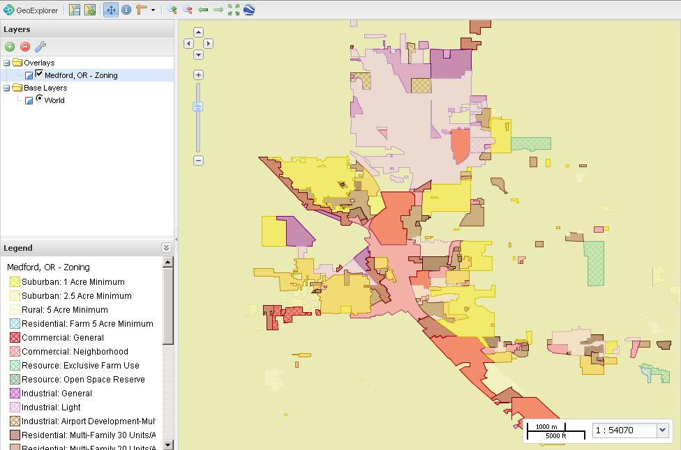

.. _builtindemos:

Built-In Demos
==============

The OpenGeo Suite comes with some sample map layers preloaded that can be viewed and restyled.

Medford
-------

The city of Medford, Oregon has generously shared some of their municipal data, including zoning, buildings, and parks.

You can use GeoExplorer to view the included layers.  Select :guilabel:`GeoExplorer` from the Dashboard to load GeoExplorer.  See the section called :ref:`workflow.create` in the :ref:`workflow` for information on adding layers in GeoExplorer, or see the full GeoExplorer Documentation by clicking :guilabel:`GeoExplorer Documentation` in the Dashboard.

   *Zoning data for Medford as seen through GeoExplorer*

Base Map
--------

Also included is a base map containing country boundaries and major cities.

These layers are shown by default when GeoExplorer is loaded.  Select :guilabel:`GeoExplorer` from the Dashboard to view this base map.

