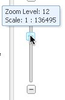
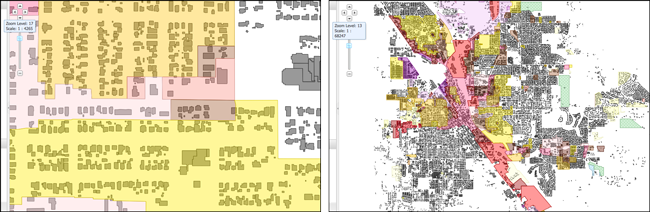

.. _styler.styling:

Styling
=======

Basic Styling
-------------

#.  With :guilabel:`Basic` styling, you can change SLD parameters including, but not limited to 
    :guilabel:`Name`, :guilabel:`Stroke`, :guilabel:`Fill` and :guilabel:`Symbol`. 
    Options vary according to geometry type.  The following figure displays the three 
    types of Basic styling forms, for point, polygon, and line respectively. 

    .. figure:: images/styling1.png
       :align: center
       :width: 600px

       *Basic Panel for a Zone Polgyon Style*

#.  Parameters options can be changed as follows:

    * :guilabel:`Name`:  type in the :guilabel:`Name` text field
    * :guilabel:`Symbol`: for Point styling, select between a circle, square, triangle, star, cross, 
      X, and custom. . from the drop down menu.

      .. figure:: images/styling2.png
         :align: center
         
         *Choosing a Point Symbol*
        
    * :guilabel:`Size`: for Point styling, set the absolute size of the graphic in pixels 
    * :guilabel:`Rotation`: Define the clockwise  rotation of the point, in decimal degrees. 
    * :guilabel:`Color`: choose a stroke color by clicking the Color text field. 

      .. figure:: images/styling3.png
         :align: center
       
         *Choosing a Stroke Color*
    
    * :guilabel:`Opacity`: set color transparency using the slider bar, with zero fully transparent,
      and 100% fully opaque.
    * :guilabel:`Style`: for Stroke styling, select between a solid, dashed, or dotted line from the 
      drop down menu
    * :guilabel:`Width`: for Stroke styling, type in a stroke width in pixels.  

Label Styling
-------------

The :guilabel:`Labels` tab defines how to display text labels. Options set here correlate to a block 
of code in the SLD called the ``<TextSymbolizer>``.  

#.  To enable label editing, select the 
    :guilabel:`Labels` tab and check :guilabel: check `Label Features`.
    
    .. figure:: images/styling4.png
       :align: center

       *Enabling Style to edit label features*

#.  :guilabel:`Label Values`: defines what label to give your style. Options refer to attributes specified 
    in your data and can be significant in number.  For example, the **RailRoad Border** layer has over 50 
    possible values.  Select the :guilabel:`Label values` that makes the most sense for your style. For 
    RailRoad Border we select the value **namelow**.
      
      .. figure:: images/styling5.png
         :align: center

         *Selecting a label value for RailRoad Borders*
         
#.  Type styling including :guilabel:`Font`, :guilabel:`Size`,  :guilabel:`Bold`, and :guilabel:`Italic` 
    determine the--not surprisingly--font, size and weight of a label. 

#.  Fill options specify the :guilabel:`Color` and :guilabel:`Opacity` that we will fill the font with.

#.  Enable :guilabel:`Halo` by check-marking the Halo box. 

    .. figure:: images/styling6.png
       :align: center

       *Enabling Halo*

#.  A halo fills an extended area outside the text label to make the label easier to read over a background.
    Essentially it is buffer outline around the text. Set the :guilabel:`Size` (in pixels), the :guilabel:`Color`,
    and :guilabel:`Opacity` of the Halo in the same manner as setting Basic styling parameters.
    
Advanced Styling
----------------

The :guilabel:`Advanced` tab allows for two possible filtering.  Limiting by scale means styles can display differently
depending on the maps zoom level.  Limiting by condition, usually based on a layer attribute value, restricts what parts 
of the layer the style applies to. 

Scale Filters
`````````````
We recommend using the Zoom Slider on the upper left corner when setting up scale-dependent styling.
At any time the current scale can be viewed by hovering over the zoom slider. 



   *Viewing zoom level*
 
The :guilabel:`Min scale limit` and the :guilabel:`Max scale limit` define the range of map-rendering scales 
for which the rule should be applied. The minimum scale refers to the smallest scale ratio, while the maximum scale the largest.
In other words, the closer you are visually to a map feature the smaller the scale limit. For example, the image on the left 
displays the Medford zone and buildings layer at a scale of 1:4625, while the image of the right displays the same zones at a 
scale of 1:68247.



   *Different scale of Medford layers.  On the left a 1:4625, on the right 1:68247*

#.  To enable filtering by scale, check the :guilabel:`Limit by scale` checkbox.  

    .. figure:: images/styling9.png
       :align: center

       *Enabling scale filtering*
      
#.  To enter your scale range, enable the Min and Max checkboxes and enter your scale amounts in the text fields. 
    To filter the range above, we can use the rounded values of 4000 and 70000.
    
    .. figure:: images/styling10.png
       :align: center

       *Creating a scale filter for the range 4K-70K*
     
Condition Filters
`````````````````
#.  To enable filtering by condition, check the :guilabel:`Limit by condition` checkbox.  

    .. figure:: images/styling11.png
       :align: center

       *Enabling condition filtering*
     
#.  The first drop down menu, :guilabel::`Match`, specifies which kind of semantic operator you're using.  Options include, 
    :guilabel:`any`, :guilabel:`or`, and :guilabel:`and`.  These relate respectively, to ``<Or>``, ``<And>``, and ``<ElseIf>``
    filters. 

#.  Choose the layer attribute to restricts styling rules, with the class drop down menu.   

    .. figure:: images/styling12.png
       :align: center

       *Selecting a layer attribute for filtering*
        
#.  Select your comparison operator in the following drop down menu.  Options include:
    - (=) PropertyIsEqualTo 
    - (<>) PropertyIsNotEqualTo 
    - (<) PropertyIsLessThan 
    - (>) PropertyIsGreaterThan 
    - (<=) PropertyIsLessThanOrEqualTo 
    - (>=) PropertyIsGreaterThanOrEqualTo 
    - (like) PropertyIsLike

#.  Type the value for filtering in the final text box. The condition in the following RailRoad example 
    is *sld_type = rail_roads*.

    .. figure:: images/styling13.png
       :align: center

       *Defining a condition filter*
        
#.  For more advanced filtering, select the :guilabel:`add condition` filter to append multiple conditions.  

     
    
    
  
  
    


