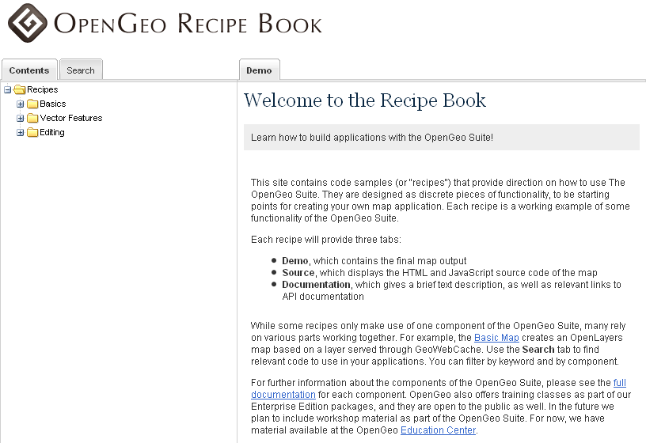

.. _recipes:

Recipe Book
===========

The OpenGeo Suite includes an application called the **Recipe Book**, which contains code examples (or "recipes") for building applications using the OpenGeo Suite.  The Recipe Book can be launched from the :ref:`dashboard`.

   *The OpenGeo Recipe Book*

Each recipe contains a map, the code required to build the map, and links to relevant API documentation.

   *A demo showing a map layer in a GeoExt MapPanel*

   *The source code required to generate the GeoExt MapPanel*