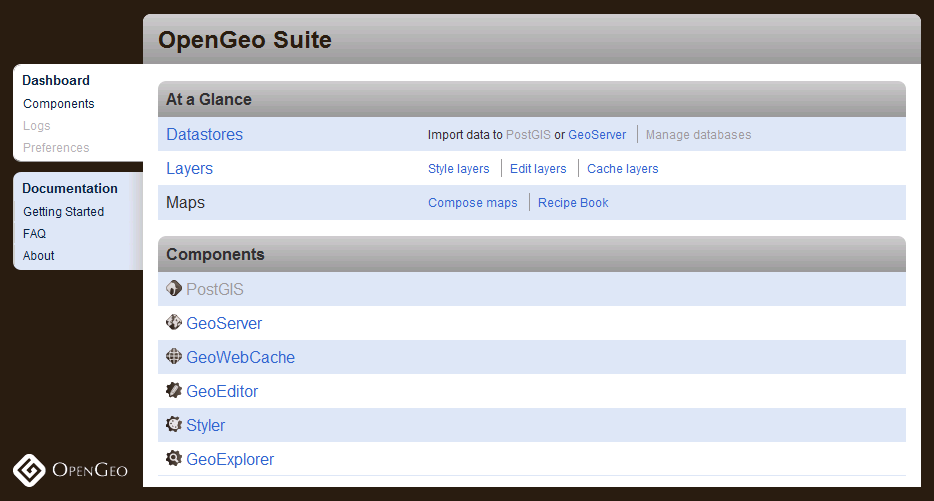

.. _installation.skygone:

Installing the OpenGeo Suite on Skygone Cloud
=============================================

The OpenGeo Suite is available as part of `Skygone <http://skygoneinc.com>`_ managed hosting solutions.  The OpenGeo Suite is available in six different tiers:

.. list-table::
   :widths: 40 20
   :header-rows: 1

   * - Name / Size
     - Cost per month
   * - Developer Slim
     - $89
   * - Developer Small
     - $249
   * - Production Small
     - $469
   * - Production Medium
     - $699
   * - Production Large
     - $1,279
   * - Production Extra Large
     - $2,449

.. note:: Details about the Instance Size (number of CPUs, etc.) can be found on the Skygone `OpenGeo GIS Marketplace <http://opengeo.thegismarketplace.com/>`_ page.

The process for signing up for any of these tiers is exactly the same.  Only the features and pricing differ.

Signing up
----------

#. Navigate to the OpenGeo GIS Marketplace page at http://opengeo.thegismarketplace.com/.

   .. figure:: img/appstore.png
      :align: center

      *OpenGeo GIS Marketplace*

#. Select the tier you wish to purchase.  The tiers vary based on computing power and price.  When finished click :guilabel:`Checkout`.  

   .. note:: For the free trial, select the :guilabel:`Developer Slim` tier.

   .. figure:: img/freetrial.png
      :align: center

      *Selecting the Free Trial*

#. If you have a Skygone account, sign in to it.  Otherwise, select :guilabel:`Create a new account` to continue.

   .. figure:: img/createnewaccount.png
      :align: center

      *Create a new account or sign in to your existing account*

#. If creating a new account, fill out the form and click :guilabel:`Submit`.  You may need to enter credit card information (if not signing up for the free trial).  When finished, click :guilabel:`Submit`.

   .. figure:: img/createnewaccountform.png
      :align: center

      *Creating a new account*

#. You will soon get an email from Skygone with information about how to connect to your instance.

   .. figure:: img/registrationsuccess.png
      :align: center

      *Successful registration*

Logging in
----------

The OpenGeo Suite Dashboard allows you to manage virtually all components of the OpenGeo Suite from one convenient interface.  To view the OpenGeo Suite, navigate to::

  http://<IP>:8080/dashboard/

where ``<IP>`` is the IP address contained in the email you received from Skygone.  If you selected a Server Name in the above sign up form, your server will be available at:

  http://<SERVERNAME>.skygone.net:8080/dashboard/

   *The OpenGeo Suite Dashboard from a successful deployment*

Skygone also has a Control Panel where you can manage the details of your server.  It is available at https://pba.skygoneinc.com/cp. 

For more information
--------------------

Please contact inquiry@opengeo.org for more information.